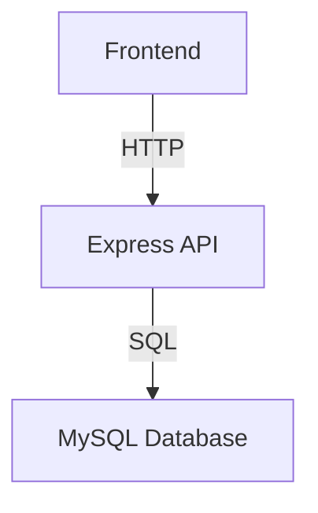

# 🏗️ Banking App Backend Assignment

In this task, you’ll turn your MySQL schema (`bank_db`) into a running Express API. In Created  folder `backend/` in your repo, and inside it follow the steps below **in order**.
# `Start with Sql - by creating the database`
---

## 1. Project Setup

-   CRUD for branches, employees, customers, accounts, and transactions
-   Money transfer with stored procedure
-   RESTful API with JSON responses

---

## 🛠️ Prerequisites

-   Node.js >= 18.x
-   MySQL >= 8.x
-   npm

---

## ⚡ Setup

1. **Clone the repository**

    ```bash
    git clone https://github.com/yourusername/express-mysql-finalProject.git
    cd express-mysql-finalProject/backend
    ```

2. **Install dependencies**

    ```bash
    npm install
    ```

3. **Configure environment variables**
   Create a `.env` file in the `backend/` directory:

    ```ini
    DB_HOST=localhost
    DB_USER=your_mysql_user
    DB_PASSWORD=your_mysql_password
    DB_NAME=bank_db
    PORT=3000
    ```

4. **Set up the database**

5. Database Connection
   File: db.js

6. **Database Connection**
    - File: `db.js`
    - Import `mysql2/promise` and `dotenv`.
    - Use `createPool` with env vars.
    - Export the pool instance.

---

## 📁 Project Structure

-   `server.js` - Express app entry point
-   `database.js` - MySQL connection pool
-   `routes/` - API route modules
-   `sql/` - SQL schema and scripts

---

## 🚦 Server Setup

-   Initialize Express app and JSON middleware.

---

## 📚 API Endpoints

### Branches

-   `GET /api/branches` - List all branches
-   `GET /api/branches/:id` - Get branch by ID
-   `POST /api/branches` - Add a branch
-   `PUT /api/branches/:id` - Update branch
-   `DELETE /api/branches/:id` - Delete branch

#### Example: Get all branches

```bash
curl http://localhost:3000/api/branches
```

#### Example Response

```json
[
    {
        "id": 1,
        "name": "Main Branch",
        "address": "123 Main St"
    }
]
```

### Employees

-   `GET /api/employees` - List all employees
-   `GET /api/employees/:id` - Get employee by ID
-   `POST /api/employees` - Add an employee
-   `PUT /api/employees/:id` - Update employee
-   `DELETE /api/employees/:id` - Delete employee

### Customers

-   `GET /api/customers` - List all customers
-   `GET /api/customers/:id` - Get customer by ID
-   `POST /api/customers` - Add a customer
-   `PUT /api/customers/:id` - Update customer
-   `DELETE /api/customers/:id` - Delete customer

### Accounts

-   `GET /api/accounts` - List all accounts (with balances)
-   `GET /api/accounts/:id` - Get account by ID (with branch & customer info)
-   `POST /api/accounts` - Open a new account
-   `PUT /api/accounts/:id` - Update status or balance
-   `DELETE /api/accounts/:id` - Close or remove an account

### Transactions

-   `GET /api/transactions` - List all transactions
-   `GET /api/transactions/:id` - Get transaction by ID
-   `POST /api/transactions` - Record a new transaction

### Transfer

-   `POST /api/transfer` - Call your transfer_money procedure
    -   Accepts JSON: `{ "from_account_id": 1, "to_account_id": 2, "transfer_amount": 100 }`

---

## 🗄️ Database Schema

<!-- Optionally include an ER diagram or describe tables -->

---

## 🖼️ Architecture



---

## 📝 Route Modules

-   `routes/branches.js`
-   `routes/employees.js`
-   `routes/customers.js`
-   `routes/accounts.js`
-   `routes/transactions.js`

---

## 🏷️ Example Route: Transactions

-   `GET /api/transactions` → list all transactions

---

## 🤝 Contributing

Pull requests welcome! Please open an issue first to discuss changes.

---

## 📄 License

MIT

---

## 📬 Contact

For questions, open an issue!
